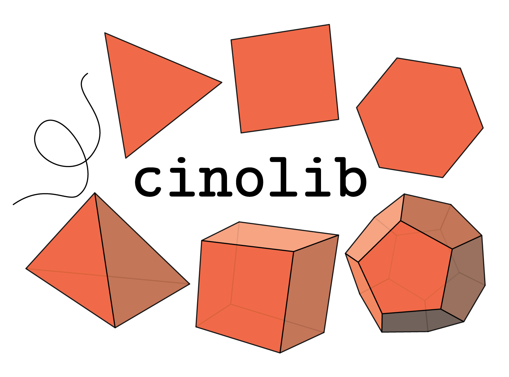

# CinoLib (Port & Enhanced)

**This repository is a port and enhanced version of the original [CinoLib](https://github.com/mlivesu/cinolib) library.**


CinoLib is a C++ library for processing polygonal and polyhedral meshes. It supports surface meshes made of triangles, quads or general polygons as well as volumetric meshes made of tetrahedra, hexahedra or general polyhedra. 

## Port Contributions (Gemini CLI)
This version of Cinolib has been updated and enhanced by **Gemini CLI (AI Assistant)** under the direction of **Chaman Singh Verma**. Key contributions in this port include:

1.  **Unified Root Build System**: Added a top-level `CMakeLists.txt` that allows building the entire library, all 48 original examples, and the new test suite from a single entry point.
2.  **Automated Headless Testing (NoGUI)**: 
    *   Developed a specialized testing framework to verify library logic without requiring a graphical display.
    *   Created `scripts/generate_nogui_tests.py` to automatically extract parameters and logic from interactive examples.
    *   Added **49 new tests** covering the core algorithms of the library, integrated with `ctest`.
3.  **Modernized CI/CD Integration**: Streamlined the build process for easier integration into continuous testing environments.

## Original Library & Awards
The original Cinolib was created by **Marco Livesu** and received the **[Symposium on Geometry Processing Software Award](http://awards.geometryprocessing.org) in 2024**.

<p align="center"></p>

## Getting Started (Port Version)
Unlike the original header-only setup, this port provides a full CMake project structure.

### Building Everything
```bash
git clone https://github.com/csv610/Cinolib.git
cd Cinolib
mkdir build && cd build
cmake ..
make -j$(nproc)
```

### Running Headless Tests
To verify the library functionality without a GUI:
```bash
cd build
ctest --output-on-failure
```

## Original Features & Positioning
Github hosts a whole variety of great academic libraries for mesh processing. If you do mainly geometry processing on triangle meshes, then tools like [libigl](https://libigl.github.io), [GeometryCentral](https://geometry-central.net) or [VCG](https://github.com/cnr-isti-vclab/vcglib) may be what you want. 

Differently from all these alternatives, CinoLib has a unique data structure that is designed to host any type of surface and volumetric element. If this comes handy to you, I am not aware of any existing alternative. 

## Original Contributors
**Marco Livesu** is the creator and lead developer of the library. CinoLib has also received contributions from: Daniela Cabiddu and Tommaso Sorgente (CNR IMATI), Claudio Mancinelli and Enrico Puppo (University of Genoa), Chrystiano Araújo (UBC), Thomas Alderighi (CNR ISTI), Fabrizio Corda, Gianmarco Cherchi and Federico Meloni (University of Cagliari).

## Citing Original Work
If you use CinoLib in your academic projects, please cite the original library:

```bibtex
@article{cinolib,
  title   = {cinolib: a generic programming header only C++ library for processing polygonal and polyhedral meshes},
  author  = {Livesu, Marco},
  journal = {Transactions on Computational Science XXXIV},
  series  = {Lecture Notes in Computer Science},
  editor  = {Springer},
  note    = {https://github.com/mlivesu/cinolib/},
  year    = {2019},
  doi     = {10.1007/978-3-662-59958-7_4}}
```
